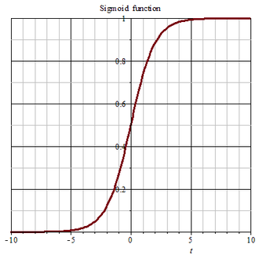
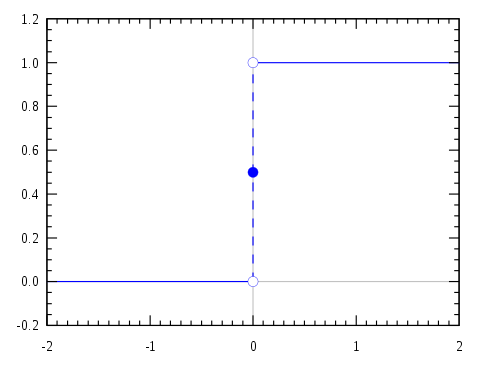
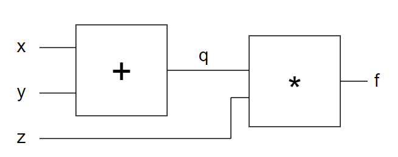

# Weekly4
> Part1：梯度下降--and, or, xor gate \
> Part2：自動微分 -- 反傳遞演算法 \
> Part3：反傳遞演算法程式

## Part1
1. [diff.py](https://github.com/ccccourse/ai/blob/master/python/03-neuralnet/01-diff/diff.py)：單變數的微分
```py
def f(x):
    return x*x

dx = 0.001

def diff(f, x):         # 單變數的微分
    df = f(x+dx)-f(x)
    return df/dx

print('diff(f,2)=', diff(f, 2))
```
* 執行結果：
```cmd
PS C:\Users\USER\Desktop\LC_AI\ai\python\03-neuralnet\01-diff> python .\diff.py
diff(f,2)= 4.000999999999699
```
2. [npGradient.py](https://github.com/ccccourse/ai/blob/master/python/03-neuralnet/02-gradient/npGradient.py)：多變數的微分
```py
import numpy as np

step = 0.01

# 我們想找函數 f 的最低點
def f(p):
    [x,y] = p
    print('x,y=', x, y)
    return x*x + y*y

## 函數 f 對變數 p[k] 的偏微分: df / dp[k]
def df(f, p, k):
    p1 = p.copy()
    p1[k] = p[k]+step
    return (f(p1) - f(p)) / step
# 對每個梯度都做偏微分


# 函數 f 在點 p 上的梯度
def grad(f, p):
    gp = p.copy()
    for k in range(len(p)):
        gp[k] = df(f, p, k)
    return gp

p = np.array([1.0,3])
print('df(f, p, 0) = ', df(f, p, 0))
print('df(f, p, 1) = ', df(f, p, 1))
print('grad(f)=', grad(f, p))
```
* 執行結果：
```cmd
PS C:\Users\USER\Desktop\LC_AI\ai\python\03-neuralnet\02-gradient> python .\npGradient.py  
x,y= 1.01 3.0
x,y= 1.0 3.0
df(f, p, 0) =  2.009999999999934
x,y= 1.0 3.01
x,y= 1.0 3.0
df(f, p, 1) =  6.009999999999849
x,y= 1.01 3.0
x,y= 1.0 3.0
x,y= 1.0 3.01
x,y= 1.0 3.0
grad(f)= [2.01 6.01]
```
3. [gdTest.py](https://github.com/ccccourse/ai/blob/master/python/03-neuralnet/03-gd/gdTest.py)：找到 x^2 + y^2 的最低點
```py
import gd1 as gd

def f(p):
    [x,y] = p
    return x*x + y*y

p = [1.0, 3.0]
gd.gradientDescendent(f, p)
```
* 執行結果：
```cmd
PS C:\Users\USER\Desktop\LC_AI\ai\python\03-neuralnet\03-gd> python .\gdTest.py
1:p=[1.0, 3.0] f(p)=10.000 gp=[2.009999999999934, 6.009999999999849] glen=6.33721
2:p=[0.9799 2.9399] f(p)=9.603 gp=[1.9698 5.8898] glen=6.21046
3:p=[0.960202 2.881002] f(p)=9.222 gp=[1.930404 5.772004] glen=6.08625        
4:p=[0.94089796 2.82328196] f(p)=8.856 gp=[1.89179592 5.65656392] glen=5.96453
5:p=[0.92198    2.76671632] f(p)=8.505 gp=[1.85396    5.54343264] glen=5.84524
6:p=[0.9034404  2.71128199] f(p)=8.167 gp=[1.8168808  5.43256399] glen=5.72833
7:p=[0.88527159 2.65695635] f(p)=7.843 gp=[1.78054319 5.32391271] glen=5.61377
8:p=[0.86746616 2.60371723] f(p)=7.532 gp=[1.74493232 5.21743445] glen=5.50149
9:p=[0.85001684 2.55154288] f(p)=7.233 gp=[1.71003368 5.11308577] glen=5.39146
10:p=[0.8329165  2.50041203] f(p)=6.946 gp=[1.675833   5.01082405] glen=5.28363
.
.
650:p=[-0.00499797 -0.00499392] f(p)=0.000 gp=[4.06367701e-06 1.21505964e-05] glen=0.00001 
651:p=[-0.00499801 -0.00499405] f(p)=0.000 gp=[3.98240347e-06 1.19075845e-05] glen=0.00001 
652:p=[-0.00499805 -0.00499417] f(p)=0.000 gp=[3.90275540e-06 1.16694328e-05] glen=0.00001
653:p=[-0.00499809 -0.00499428] f(p)=0.000 gp=[3.82470029e-06 1.14360442e-05] glen=0.00001 
654:p=[-0.00499813 -0.0049944 ] f(p)=0.000 gp=[3.74820629e-06 1.12073233e-05] glen=0.00001 
655:p=[-0.00499816 -0.00499451] f(p)=0.000 gp=[3.67324216e-06 1.09831768e-05] glen=0.00001 
656:p=[-0.0049982  -0.00499462] f(p)=0.000 gp=[3.59977732e-06 1.07635133e-05] glen=0.00001 
657:p=[-0.00499824 -0.00499473] f(p)=0.000 gp=[3.52778177e-06 1.05482430e-05] glen=0.00001 
658:p=[-0.00499827 -0.00499483] f(p)=0.000 gp=[3.45722613e-06 1.03372781e-05] glen=0.00001 
659:p=[-0.00499831 -0.00499493] f(p)=0.000 gp=[3.38808161e-06 1.01305326e-05] glen=0.00001 
660:p=[-0.00499834 -0.00499504] f(p)=0.000 gp=[3.32031998e-06 9.92792193e-06] glen=0.00001 
661:p=[-0.00499837 -0.00499514] f(p)=0.000 gp=[3.25391358e-06 9.72936349e-06] glen=0.00001 
662:p=[-0.00499841 -0.00499523] f(p)=0.000 gp=[3.18883531e-06 9.53477622e-06] glen=0.00001 
663:p=[-0.00499844 -0.00499533] f(p)=0.000 gp=[3.1250586e-06 9.3440807e-06] glen=0.00001
```
4. [gdArray.py](https://github.com/ccccourse/ai/blob/master/python/03-neuralnet/03-gd/gdArray.py)：三維的例子，找最低點
```py
import gd2 as gd

def f(p):
    [x, y, z] = p
    return x*x + 3*y*y + z*z - 4*x - 3*y - 5*z + 8

p = [0.0, 0.0, 0.0]
gd.gradientDescendent(f, p)
```
* 執行結果：
```cmd
PS C:\Users\USER\Desktop\LC_AI\ai\python\03-neuralnet\03-gd> python .\gdArray.py
1:p=[0.0, 0.0, 0.0] f(p)=8.000 gp=[-3.990000000000027, -2.970000000000006, -4.9900000000000055] glen=7.04564
2:p=[0.0399 0.0297 0.0499] f(p)=7.509 gp=[-3.9102 -2.7918 -4.8902] glen=6.85550
3:p=[0.079002 0.057618 0.098802] f(p)=7.043 gp=[-3.831996 -2.624292 -4.792396] glen=6.67369
4:p=[0.11732196 0.08386092 0.14672596] f(p)=6.602 gp=[-3.75535608 -2.46683448 -4.69654808] glen=6.49966
5:p=[0.15487552 0.10852926 0.19369144] f(p)=6.183 gp=[-3.68024896 -2.31882441 -4.60261712] glen=6.33287
6:p=[0.19167801 0.13171751 0.23971761] f(p)=5.786 gp=[-3.60664398 -2.17969495 -4.51056478] glen=6.17286
7:p=[0.22774445 0.15351446 0.28482326] f(p)=5.408 gp=[-3.5345111  -2.04891325 -4.42035348] glen=6.01916
8:p=[0.26308956 0.17400359 0.32902679] f(p)=5.049 gp=[-3.46382088 -1.92597845 -4.33194641] glen=5.87139
9:p=[0.29772777 0.19326338 0.37234626] f(p)=4.707 gp=[-3.39454446 -1.81041975 -4.24530748] glen=5.72915
10:p=[0.33167321 0.21136757 0.41479933] f(p)=4.381 gp=[-3.32665357 -1.70179456 -4.16040133] glen=5.59211
.
.
656:p=[1.99499643 0.495      2.49499553] f(p)=-3.000 gp=[-7.14582669e-06 -1.77635684e-13 -8.93676084e-06] glen=0.00001
657:p=[1.9949965  0.495      2.49499562] f(p)=-3.000 gp=[-7.00291007e-06  0.00000000e+00 -8.75802524e-06] glen=0.00001
658:p=[1.99499657 0.495      2.49499571] f(p)=-3.000 gp=[-6.86285180e-06  0.00000000e+00 -8.58286509e-06] glen=0.00001
659:p=[1.99499664 0.495      2.49499579] f(p)=-3.000 gp=[-6.72559466e-06  1.77635684e-13 -8.41120738e-06] glen=0.00001
660:p=[1.9949967  0.495      2.49499588] f(p)=-3.000 gp=[-6.59108306e-06  0.00000000e+00 -8.24298336e-06] glen=0.00001
661:p=[1.99499677 0.495      2.49499596] f(p)=-3.000 gp=[-6.45926121e-06  0.00000000e+00 -8.07812395e-06] glen=0.00001
662:p=[1.99499683 0.495      2.49499604] f(p)=-3.000 gp=[-6.33007602e-06  1.77635684e-13 -7.91656092e-06] glen=0.00001
663:p=[1.9949969  0.495      2.49499612] f(p)=-3.000 gp=[-6.20347436e-06  1.77635684e-13 -7.75822979e-06] glen=0.00001
```
5. [gdGate.py](https://github.com/ccccourse/ai/blob/master/python/03-neuralnet/03-gd/gdGate.py)：損失函數，能量函數
```py
import numpy as np
import math
import gd3 as gd

# 神經網路早期常使用的函數 - sigmoid函數
def sig(t):
    return 1.0/(1.0+math.exp(-t))

o = [0,0,0,1] # and gate outputs
# o = [0,1,1,1] # or gate outputs
# o = [0,1,1,0] # xor gate outputs

# 損失函數，單一神經元
def loss(p):
    [w1,w2,b] = p
    o0 = sig(w1*0+w2*0+b)
    o1 = sig(w1*0+w2*1+b)
    o2 = sig(w1*1+w2*0+b)
    o3 = sig(w1*1+w2*1+b)
    delta = np.array([o0-o[0], o1-o[1], o2-o[2], o3-o[3]]) 
    # o0：目前網路的輸出，o[0]：標準答案
    print('o0={:.3f} o1={:.3f} o2={:.3f} o3={:.3f}'.format(o0,o1,o2,o3))
    return np.linalg.norm(delta, 2) 
    # 取平方加總之後開根號，求范數而我們使用 歐基里德范數

# 起始點
p = [0.0, 0.0, 0.0] # [w1,w2,b] 
# 梯度下降法        (能量函數，起始點，最多跑到3000停止)
gd.gradientDescendent(loss, p, max_loops=3000)
```
* 執行結果：
```cmd
PS C:\Users\USER\Desktop\LC_AI\ai\python\03-neuralnet\03-gd> python .\gdGate.py
o0=0.500 o1=0.500 o2=0.500 o3=0.500
o0=0.500 o1=0.500 o2=0.500 o3=0.500
o0=0.500 o1=0.500 o2=0.502 o3=0.502
o0=0.500 o1=0.500 o2=0.500 o3=0.500
o0=0.500 o1=0.502 o2=0.500 o3=0.502
o0=0.500 o1=0.500 o2=0.500 o3=0.500
o0=0.502 o1=0.502 o2=0.502 o3=0.502
o0=0.500 o1=0.500 o2=0.500 o3=0.500
0:p=[0.0, 0.0, 0.0] f(p)=1.000 gp=[0.0006249876304487145, 0.0006249876304487145, 0.25093305885433015] glen=0.25093
o0=0.499 o1=0.499 o2=0.499 o3=0.499
.
.
o0=0.061 o1=0.266 o2=0.264 o3=0.667
o0=0.061 o1=0.264 o2=0.264 o3=0.665
o0=0.062 o1=0.266 o2=0.266 o3=0.667
o0=0.061 o1=0.264 o2=0.264 o3=0.665
2999:p=[ 1.70788532  1.70788532 -2.73199632] f(p)=0.506 gp=[-0.04493286 -0.04493286  0.06420767] glen=0.09034
```
* sigmoid函數 & step function 步階函數

-|sigmoid function|step function
-|:-|:-
圖型||
說明|以0.5做區隔|在0.5以下通通都是 0，在0.5以上通通都是 1
差異|圖型較平滑，故每一點都可以做微分|在0.5這點上不能做微分

> 梯度下降法需要可微分的函數，所以大部分利用sigmoid function

* 執行 And、Or、Xor gate
> [gdGate.py](https://github.com/ccccourse/ai/blob/master/python/03-neuralnet/03-gd/gdGate.py)這個程式執行and, or gate都能找到標準答案，但是xor gate用**單層神經網路**會找不到，在執行會遇到直接停下來，原因是因為能量函數變大的關係，於是到[gd3.py](https://github.com/ccccourse/ai/blob/master/python/03-neuralnet/03-gd/gd3.py)看到`def gradientDescendent()`下有`fp0 < fp`這個條件，所以能量函數變大就自然停下來，於是我們把條件註解，讓xor可以繼續跑但是最終還是會找不到正確解。

6. [gdGate.md](https://github.com/ccccourse/ai/blob/master/python/03-neuralnet/03-gd/gdGate.md)：機器學習、神經網路
```md
f(i) = o

learn f:
give 

    標準答案
i0 => o0      f(i0) => o0' -> o0 != o0'
i1 => o1      f(i1) => o1' -> o1 != o1'
i2 => o2      f(i2) => o2' -> o2 != o2'
.....
輸入
in => on      f(in) => on' -> on != on'

delta = [o0-o0', o1-o1', ...., on-on']
# 我們希望差距越小越好

loss = norm(delta)
# 差距衡量方式 
```
調整 w 後得到 f 使 delta 越小越好

## Part2
1. [陳鍾誠老師的網站-反傳遞演算法 -- 手算案例](http://www.misavo.com/blog/%E9%99%B3%E9%8D%BE%E8%AA%A0/%E6%9B%B8%E7%B1%8D/%E4%BA%BA%E5%B7%A5%E6%99%BA%E6%85%A7/03-%E7%A5%9E%E7%B6%93%E7%B6%B2%E8%B7%AF/D-%E5%8F%8D%E5%82%B3%E9%81%9E%E7%AE%97%E6%B3%95--%E6%89%8B%E7%AE%97%E6%A1%88%E4%BE%8B)
* 反傳遞演算 自動微分的原理是來自偏微分的鏈鎖規則
* 要先正向傳遞，再反傳遞

-|原因
-|-
反傳遞演算法|只要把結果偏微分設定為1，往回推算梯度
數值算法|要一個一個假設算結果，太慢

## Part3
1. [net.py](https://github.com/ccccourse/ai/blob/master/python/03-neuralnet/04-net/net.py)
```py
class Node:
    def __init__(self, v = 0, g = 0):
        self.v = v # 輸出值 (f(x))
        self.g = g # 梯度值 (偏微分)

    # 格式化後美觀
    def __str__(self):
        return 'v:{self.v} g:{self.g}'.format(self=self)

class Gate:                      # 對 x 取偏微分，對 y 取偏微分
    def __init__(self, o, x, y, f, gfx, gfy):
        self.o = o
        self.x = x
        self.y = y
        self.f = f
        self.gfx = gfx
        self.gfy = gfy

    # 前向計算，呼叫 f 把值丟進去
    def forward(self):
        self.o.v = self.f(self.x.v, self.y.v)
        return self.o.v

    def backward(self):
        x, y, o, gfx, gfy = self.x, self.y, self.o, self.gfx, self.gfy
        x.g += gfx(x.v,y.v) * o.g
        y.g += gfy(x.v,y.v) * o.g

    def adjust(self, step=0.001): # 朝逆梯度的方向走一小步
        x, y = self.x, self.y
        x.v -= step*x.g
        y.v -= step*y.g
        x.g = 0    # 調整完後把 g 歸零
        y.g = 0

class Net:
    def __init__ (self):
        self.gates = []

    def variable (self, v, g=0):
        return Node(v, g)

    # 創建一個新的閘
    def op (self, x, y, f, gfx, gfy):
        o = Node()
        g = Gate(o, x, y, f, gfx, gfy)
        self.gates.append(g)
        self.o = o
        return o

    # 新的加法閘
    def add (self, x, y):
        return self.op(x, y, lambda x,y:x+y, lambda x,y:1, lambda x,y:1) 
    # 新的乘法閘
    def mul (self, x, y):
        return self.op(x, y, lambda x,y:x*y, lambda x,y:y, lambda x,y:x) 

    def forward(self): # 正向傳遞計算結果
        for gate in self.gates:
            gate.forward()
        return self.o.v

    def backward(self): # 反向傳遞計算梯度 
        self.o.g = 1 # 設定輸出節點 o 的梯度為 1
        for gate in reversed(self.gates): # 反向傳遞計算每個節點 Node 的梯度 g
            gate.backward() # 開始反向傳遞

    def adjust(self, step=0.01): # 朝逆梯度的方向走一小步
        for gate in self.gates:
            gate.adjust(step)

    # 使用 forward-backward 的方式計算梯度的梯度下降法
    def gradient_descendent (self, maxLoops=100, dumpPeriod=1, step=0.01):
        for loop in range(maxLoops):
            energy = self.forward() # 是從 x+y 往前算，算出每一個的值的意思
            if loop % dumpPeriod==0:
                print(loop, ' => ', energy)
            self.backward()   # 反傳遞一次
            self.adjust(step) # 往逆梯度調整一點
```
* f = x^2 + y^2 的執行結果：
```cmd
PS C:\Users\USER\Desktop\LC_AI\ai\python\03-neuralnet\04-net> python .\net2.py
0  =>  10
1  =>  9.216
2  =>  8.4934656        
3  =>  7.827577896960003
4  =>  7.213895789838339
5  =>  6.648326359915014
.
.
95  =>  0.004280892060076547
96  =>  0.003945270122566546
97  =>  0.003635960944957329
98  =>  0.003350901606872675
99  =>  0.003088190920893857
x= 0.01687031935884968 y= 0.050610958076549
```
* 搭配圖[gateNet.png](C:\Users\USER\Desktop\LC_AI\ai108b\Note\Images\W04\gateNet.png)


2. [net1.py](https://github.com/ccccourse/ai/blob/master/python/03-neuralnet/04-net/net1.py)
* 做了一次正向傳遞，再做反向傳遞
```py
from net import Net
net = Net()

x = net.variable(1)
y = net.variable(2)
o  = net.mul(x, y) # o = x*y

# 正向傳遞
print('net.forward()=', net.forward())
# 反向傳遞
print('net.backwward()')
net.backward()
print('x=', x, 'y=', y, 'o=', o)
print('gfx = x.g/o.g = ', x.g/o.g, 'gfy = y.g/o.g=', y.g/o.g)

# net.gradient_descendent()
```
* 執行結果：
```cmd
PS C:\Users\USER\Desktop\LC_AI\ai\python\03-neuralnet\04-net> python .\net1.py
net.forward()= 2  # 前向正向傳遞結果
net.backwward()
x= v:1 g:2 y= v:2 g:1 o= v:2 g:1  # x 的梯度，y的梯度，輸出的梯度
gfx = x.g/o.g =  2.0 gfy = y.g/o.g= 1.0
```


---
資料來源&參考：
- [陳鍾誠老師的網站-人工智慧/03-神經網路](http://www.misavo.com/blog/%E9%99%B3%E9%8D%BE%E8%AA%A0/%E6%9B%B8%E7%B1%8D/%E4%BA%BA%E5%B7%A5%E6%99%BA%E6%85%A7/03-%E7%A5%9E%E7%B6%93%E7%B6%B2%E8%B7%AF)
- [Sigmoid 函數](https://zh.wikipedia.org/wiki/S%E5%87%BD%E6%95%B0)
- [Step 函數](https://en.wikipedia.org/wiki/Step_function)
- [Relu 函數](https://zh.wikipedia.org/wiki/%E7%BA%BF%E6%80%A7%E6%95%B4%E6%B5%81%E5%87%BD%E6%95%B0)
- [范數](https://zh.wikipedia.org/wiki/%E8%8C%83%E6%95%B0)

- [陳鍾誠老師的網站-人工智慧/03-神經網路/反傳遞演算法 -- 手算案例](http://www.misavo.com/blog/%E9%99%B3%E9%8D%BE%E8%AA%A0/%E6%9B%B8%E7%B1%8D/%E4%BA%BA%E5%B7%A5%E6%99%BA%E6%85%A7/03-%E7%A5%9E%E7%B6%93%E7%B6%B2%E8%B7%AF/D-%E5%8F%8D%E5%82%B3%E9%81%9E%E7%AE%97%E6%B3%95--%E6%89%8B%E7%AE%97%E6%A1%88%E4%BE%8B)
