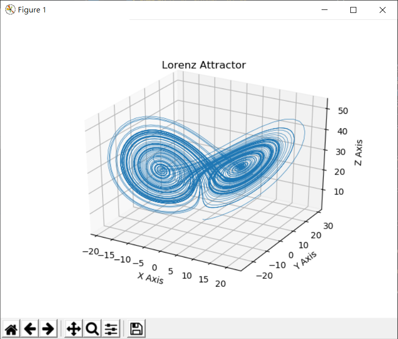
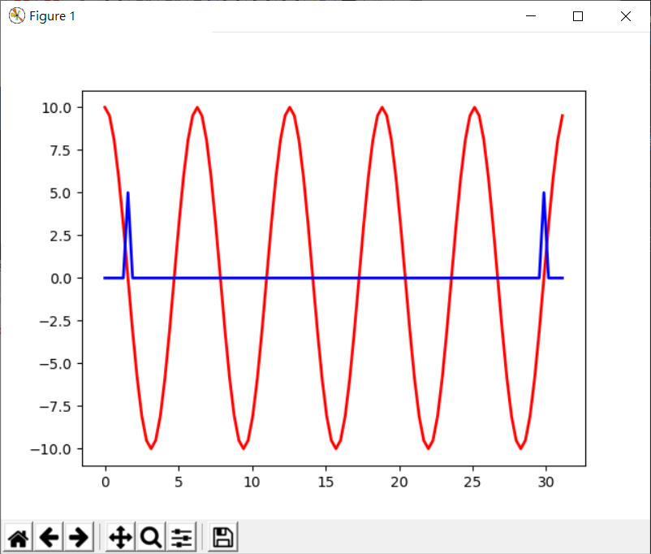
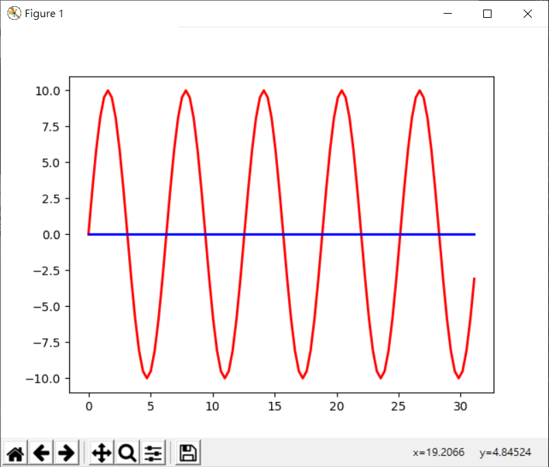
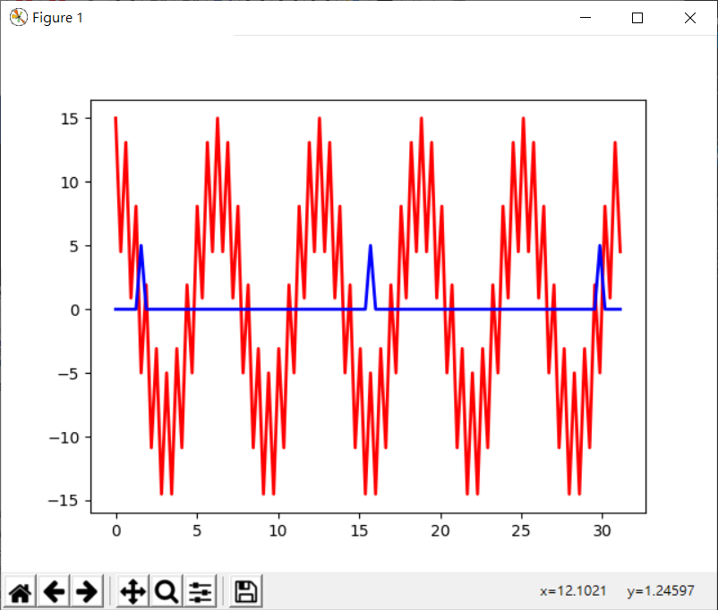

# Weekly10
> Part1：科學計算 \
> Part2：科學計算 Chaos, DiffEquation \
> Part3：科學計算 Fourier Transform
## Part1
1. 介紹 [科學計算套件](http://www.misavo.com/blog/%E9%99%B3%E9%8D%BE%E8%AA%A0/%E6%9B%B8%E7%B1%8D/%E7%A7%91%E5%AD%B8%E8%A8%88%E7%AE%97/A1-%E7%A7%91%E5%AD%B8%E8%A8%88%E7%AE%97%E5%A5%97%E4%BB%B6)
2. [root2.py](https://github.com/ccccourse/ai/blob/master/python/08-scientific/algebra/root2.py)：
```py
import math

def root2(a,b,c):
    t = b*b - 4*a*c 
    if (t < 0):
        raise Exception('沒有實根')
    t2 = math.sqrt(t)   # 取根號
    return [(-b+t2)/(2*a), (-b-t2)/(2*a)]


print("root of 1x^2+4x+0=", root2(1,4,0))
```
* 執行結果：找到解 (0, -4)
```c
PS C:\Users\USER\Desktop\LC_AI\ai\python\08-scientific\algebra> python .\root2.py
root of 1x^2+4x+0= [0.0, -4.0]
```
3. [simplify1.py](https://github.com/ccccourse/ai/blob/master/python/08-scientific/algebra/simplify1.py)：會自動把數學式子簡化
    * sympy：專門來處理數學運算
```py
import sympy as sp

x = sp.symbols("x")
exp1 = (x+2)**2-(x+1)**2
print('exp1=', exp1)    # 不簡化的式子-> 原式
exp2 = sp.simplify((x+2)**2-(x+1)**2)
print('exp2=', exp2)    # 簡化過後的式子
```
* 執行結果：
```c
PS C:\Users\USER\Desktop\LC_AI\ai\python\08-scientific\algebra> python .\simplify1.py
exp1= -(x + 1)**2 + (x + 2)**2
exp2= 2*x + 3
```
4. 微積分 
* [diff1.py](https://github.com/ccccourse/ai/blob/master/python/08-scientific/calculus/diff1.py)：單變數函數的一次微分
* [diffn.py](https://github.com/ccccourse/ai/blob/master/python/08-scientific/calculus/diffn.py)：單變數函數的n次微分
```py
from math import *

step = 0.0001
def df(f, x, h=step):
    return (f(x+h)-f(x-h))/(2*h)

def dfn(f, x, n, h=step):
    if (n == 0): return f(x)
    if (n == 1): return df(f,x,h)
    return (dfn(f, x+h, n-1) - dfn(f, x-h, n-1))/(2*h)

print('df(sin, pi/4)=', df(sin, pi/4))

for i in range(10): # 做10次微分，可能會發散，導致誤差越來越大
    print('dfn(sin,', i, 'pi/4)=', dfn(sin, pi/4, i))
```
* 執行結果：
```c
PS C:\Users\USER\Desktop\LC_AI\ai\python\08-scientific\calculus> python .\diffn.py    
df(sin, pi/4)= 0.70710678000796
dfn(sin, 0 pi/4)= 0.7071067811865476
dfn(sin, 1 pi/4)= 0.70710678000796
dfn(sin, 2 pi/4)= -0.7071067842367995
dfn(sin, 3 pi/4)= -0.7071010443837622
dfn(sin, 4 pi/4)= 1.1796119636642288
dfn(sin, 5 pi/4)= -693.8893903907228
dfn(sin, 6 pi/4)= -41633363.42344337
dfn(sin, 7 pi/4)= 69388939039.07228
dfn(sin, 8 pi/4)= 3729655473350135.5
dfn(sin, 9 pi/4)= -6.505213034913026e+18
```
5. 數值積分 [integrate1.py](https://github.com/ccccourse/ai/blob/master/python/08-scientific/calculus/integrate1.py)：把分割、步伐切割越小越好
```py
# 參考 https://en.wikipedia.org/wiki/Integral
from math import *

def integrate(f, a, b, h=0.001):
    area = 0
    x = a
    while (x < b):  # 從 a 到 b 一步一步走，算黎曼積分
        area += f(x)*h
        x += h
    return area

print('integrate(sin, 0, pi)=', integrate(sin, 0, pi))
```
* 執行結果：
```c
PS C:\Users\USER\Desktop\LC_AI\ai\python\08-scientific\calculus> python .\integrate1.py
integrate(sin, 0, pi)= 1.9999999540411524
# 從 0 到 pi 的積分
```
6. [sym_diff1.py](https://github.com/ccccourse/ai/blob/master/python/08-scientific/calculus/sym_diff1.py) 符號微分：使用 sympy
```py
# https://docs.sympy.org/1.5.1/tutorial/calculus.html
from sympy import *
x, y, z = symbols('x y z')
init_printing(use_unicode=True)

print('diff(cos(x), x)=', diff(cos(x), x))  # 對cos(x)取微分
print('diff(exp(x**2), x)=', diff(exp(x**2), x))    # 對exp(x**2)取微分
```
* 執行結果：
```c
# 如果沒安裝 sympy，可執行 pip install sympy
PS C:\Users\USER\Desktop\LC_AI\ai\python\08-scientific\calculus> python .\sym_diff1.py
diff(cos(x), x)= -sin(x)
diff(exp(x**2), x)= 2*x*exp(x**2)
```
7. [sym_integrate1.py](https://github.com/ccccourse/ai/blob/master/python/08-scientific/calculus/sym_integrate1.py) 符號積分：使用 sympy
```py
# https://docs.sympy.org/1.5.1/tutorial/calculus.html
from sympy import *
x, y, z = symbols('x y z')
init_printing(use_unicode=True)

print('integrate(cos(x), x)=', integrate(cos(x), x))
print('integrate(exp(-x), (x, 0, oo))=', integrate(exp(-x), (x, 0, oo)))
# 對 x 方向，從 0 積到 無限大

expr = Integral(log(x)**2, x)
print('Integral(log(x)**2, x)=', expr.doit())
```
* 執行結果：
```c
PS C:\Users\USER\Desktop\LC_AI\ai\python\08-scientific\calculus> python .\sym_integrate1.py
integrate(cos(x), x)= sin(x)
integrate(exp(-x), (x, 0, oo))= 1   
Integral(log(x)**2, x)= x*log(x)**2 - 2*x*log(x) + 2*x
```
8. [sym_partial1.py](https://github.com/ccccourse/ai/blob/master/python/08-scientific/calculus/sym_partial1.py) 運算式的符號偏微分
```py
# https://docs.sympy.org/1.5.1/tutorial/calculus.html
from sympy import *

init_printing(use_unicode=True)

x, y, z = symbols('x y z')
expr = exp(x*y*z)
print('diff(xyz)=', diff(expr, x))
# 運算式對 x 取微分，剩 y、z
```
* 執行結果：
```c
PS C:\Users\USER\Desktop\LC_AI\ai\python\08-scientific\calculus> python .\sym_partial1.py  
diff(xyz)= y*z*exp(x*y*z)
```
9. [sym_pintegrate1.py](https://github.com/ccccourse/ai/blob/master/python/08-scientific/calculus/sym_pintegrate1.py) 符號的多變數積分
```py
from sympy import *
x, y = symbols('x y')

i1 = Integral(x*y*exp(-x), (x, 0, oo))  # 對 x 方向，從 0 積到 無限大
print('Integral(x*y*exp(-x), (x, 0, oo))=', i1.doit())
```
* 執行結果：
```c
PS C:\Users\USER\Desktop\LC_AI\ai\python\08-scientific\calculus> python .\sym_pintegrate1.py
Integral(x*y*exp(-x), (x, 0, oo))= y
```
## Part2
1. 混沌理論(Chaos)：從電腦符點數的計算系統開始發展出來，通常會有微小誤差，當我們去做迭帶運算時，常常會發生混沌現象(蝴蝶效應)；誤差有時會造成發散，但永遠不會重疊與相差太大。
2. [lorenz.py](https://github.com/ccccourse/ai/blob/master/python/08-scientific/chaos/lorenz.py) [勞侖次吸子](https://zh.wikipedia.org/wiki/%E6%B4%9B%E4%BC%A6%E8%8C%A8%E5%90%B8%E5%BC%95%E5%AD%90)
* 執行結果：

> 畫出來得軌跡不會封閉與重疊，會跑到符點數都用完了才會重疊(但很難)
3. [mandelbrot.py](https://github.com/ccccourse/ai/blob/master/python/08-scientific/chaos/mandelbrot.py) 碎行幾何
* 執行結果：

4. [diffeq1.py](https://github.com/ccccourse/ai/blob/master/python/08-scientific/diffequation/diffeq1.py) 微分方程
```py
# https://docs.sympy.org/1.5.1/modules/solvers/ode.html
from sympy import Function, dsolve, Eq, Derivative, sin, cos, symbols
from sympy.abc import x
f = Function('f')
    # 工程分析(dsolve) 是 sympy 的套件，
sol = dsolve(Derivative(f(x), x, x) + 9*f(x), f(x))
print('dsolve(Derivative(f(x), x, x) + 9*f(x), f(x))=', sol.doit())
# f(x)對 x 取二次微分，再加上 9*f(x) = f(x)
```
* 執行結果：
```c
PS C:\Users\USER\Desktop\LC_AI\ai\python\08-scientific\diffequation> python .\diffeq1.py
dsolve(Derivative(f(x), x, x) + 9*f(x), f(x))= Eq(f(x), C1*sin(3*x) + C2*cos(3*x))
```
* 例子：行星克卜勒定律、廣義相對論、相對論重力場方程式、量子力學 波函數、薛丁格方程式、LC 電路、RLC 電路、RC 電路

## Part3
1. [傅立葉轉換](https://hackmd.io/@sysprog/fourier-transform?fbclid=IwAR1VVDMT7l56NtA8Hikf3AfpsDwq0QHEPbztTVuZkHftuz_hY9SSgKwLSIk)：把一個波形轉成音調高低
2. [fft1.py](https://github.com/ccccourse/ai/blob/master/python/08-scientific/fourier/fft1.py)
```py
# https://docs.scipy.org/doc/numpy/reference/generated/numpy.fft.fft.html
import numpy as np
import matplotlib.pyplot as plt
np.set_printoptions(precision=4, suppress=True)
t = np.arange(0, 10*np.pi, 0.1*np.pi)
# ft = 10*np.sin(t) # 虛部有
ft = 10*np.cos(t)   # 實部有
fi = np.fft.ifft(ft)    # 逆轉換
print('ft=', ft)
print('fi=', fi)
```
* 繪出成果：
    * cos

    * sin

3. [fft3.py](https://github.com/ccccourse/ai/blob/master/python/08-scientific/fourier/fft3.py)
* 執行結果：


---
資料來源&參考：
- [陳鍾誠老師的網站-科學計算](http://www.misavo.com/blog/%E9%99%B3%E9%8D%BE%E8%AA%A0/%E6%9B%B8%E7%B1%8D/%E7%A7%91%E5%AD%B8%E8%A8%88%E7%AE%97)
- [黎曼積分 Integral](https://en.wikipedia.org/wiki/Integral?fbclid=IwAR0sX84mxdvWkIUr_zGmGENGrCW1jCsxV8GpOmf876JOjgdWDkmpkIsDYTA)
- [混沌理論](https://zh.wikipedia.org/wiki/%E6%B7%B7%E6%B2%8C%E7%90%86%E8%AE%BA)
- [勞侖次吸子](https://zh.wikipedia.org/wiki/%E6%B4%9B%E4%BC%A6%E8%8C%A8%E5%90%B8%E5%BC%95%E5%AD%90)
- [碎形](https://zh.wikipedia.org/wiki/%E5%88%86%E5%BD%A2)
- [克卜勒定律](https://zh.wikipedia.org/wiki/%E5%BC%80%E6%99%AE%E5%8B%92%E5%AE%9A%E5%BE%8B?fbclid=IwAR0bPR5TLY5gifYfclXHYtYHu97o6jiS1PMot2YreIufNB572jEPG5awgKI)
- [相對論重力場方程式](https://zh.wikipedia.org/wiki/%E7%88%B1%E5%9B%A0%E6%96%AF%E5%9D%A6%E5%9C%BA%E6%96%B9%E7%A8%8B?fbclid=IwAR2u-xUbWwt-VxWT8Jbfh2DsmiUP6dFtuCRUAVpRyyYRIRrZzMV8L6OuyQ4)
- [薛丁格方程式](https://zh.wikipedia.org/wiki/%E6%B3%A2%E5%87%BD%E6%95%B0?fbclid=IwAR0iVmUxdqj4n5KNlIf6cpQwBqUVM_1BHEWRG_vW7zv8vJxqSv_hnI5sH8g#%E8%96%9B%E4%B8%81%E6%A0%BC%E6%96%B9%E7%A8%8B%E5%BC%8F)
- [LC 電路](https://zh.wikipedia.org/wiki/LC%E7%94%B5%E8%B7%AF?fbclid=IwAR2tK8iXg279ea1p3JX9l9e6Q0fLQlqzCK0dJzFOXQWjXzhnHji-taN3mnY)
- [RLC 電路](https://zh.wikipedia.org/wiki/RLC%E7%94%B5%E8%B7%AF?fbclid=IwAR2tK8iXg279ea1p3JX9l9e6Q0fLQlqzCK0dJzFOXQWjXzhnHji-taN3mnY)
- [RC 電路](https://zh.wikipedia.org/wiki/RC%E9%9B%BB%E8%B7%AF?fbclid=IwAR2iU-hQkXQd5pIgqkc3tJ-cpX3r4f_ewBfh36jELi0F3xek30lCxftl54k)
- [傅立葉轉換](https://hackmd.io/@sysprog/fourier-transform?fbclid=IwAR1VVDMT7l56NtA8Hikf3AfpsDwq0QHEPbztTVuZkHftuz_hY9SSgKwLSIk)
