# Weekly12 
> Part1：矩陣 \
> Part2：機率統計 \
> Part3：模式識別

## Part1
1. 講解上禮拜的 [eigen1.py](https://github.com/ccccourse/ai/blob/master/python/08-scientific/matrix/eigen1.py)、[solve1.py](https://github.com/ccccourse/ai/blob/master/python/08-scientific/matrix/solve1.py)、[svd1.py](https://github.com/ccccourse/ai/blob/master/python/08-scientific/matrix/svd1.py)：我直接補充到上禮拜的筆記中
2. [leastSquare1.py](https://github.com/ccccourse/ai/blob/master/python/08-scientific/matrix/leastSquare1.py)：最小平方法
```py
import numpy as np
from scipy import optimize  # 最小平方法

X = np.array([8.19, 2.72, 6.39, 8.71, 4.7, 2.66, 3.78])
Y = np.array([7.01, 2.78, 6.47, 6.71, 4.1, 4.23, 4.05])

def residuals(p):
  k, b = p
  return Y - (k*X+b)  # k 是斜率，b 是位移

r = optimize.leastsq(residuals, [1,0])
k,b = r[0]
print('k=', k, 'b=', b)
```
* 執行結果：
```c
PS C:\Users\USER\Desktop\LC_AI\ai\python\08-scientific\matrix> python .\leastSquare1.py
k= 0.6134953491930442 b= 1.794092543259387
```
3. 物理學：場線
    1. [arrow1.py](https://github.com/ccccourse/ai/blob/master/python/08-scientific/physics/arrow1.py)
    * 執行結果：
    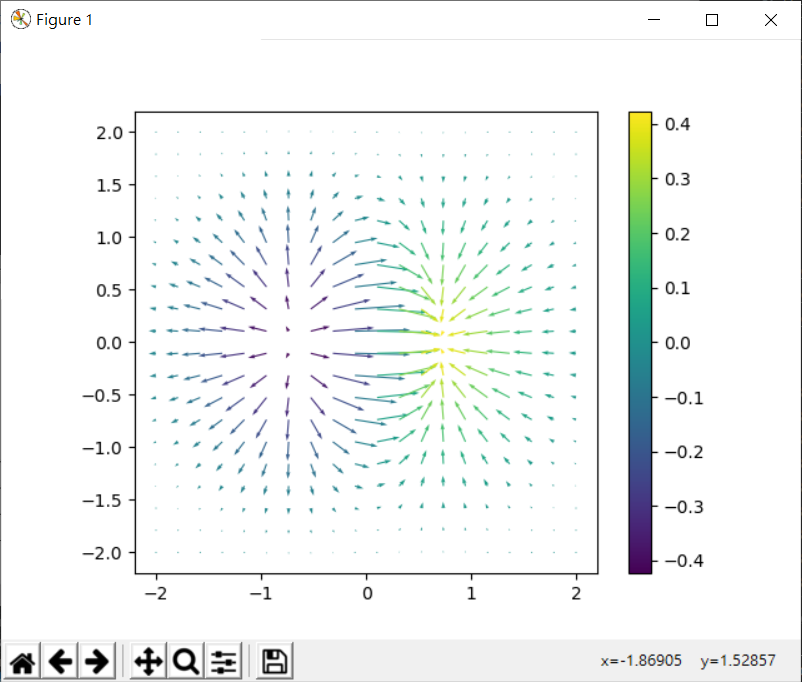
    2. [contour1.py](https://github.com/ccccourse/ai/blob/master/python/08-scientific/physics/contour1.py)
    * 執行結果：
    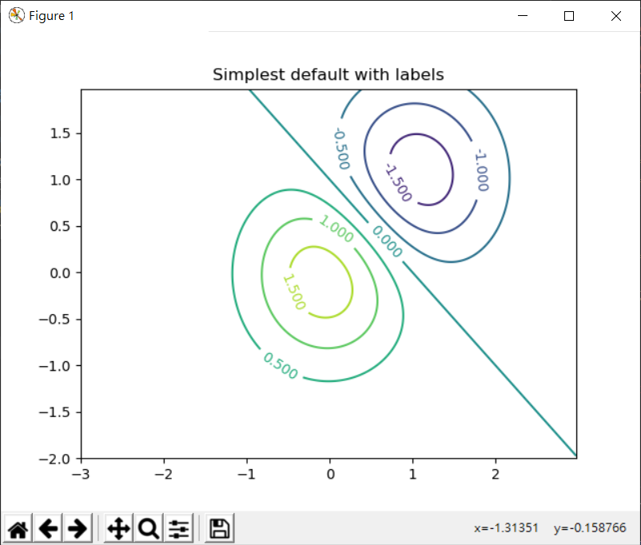
    3. [quiver1.py](https://github.com/ccccourse/ai/blob/master/python/08-scientific/physics/quiver1.py)
    * 執行結果：
    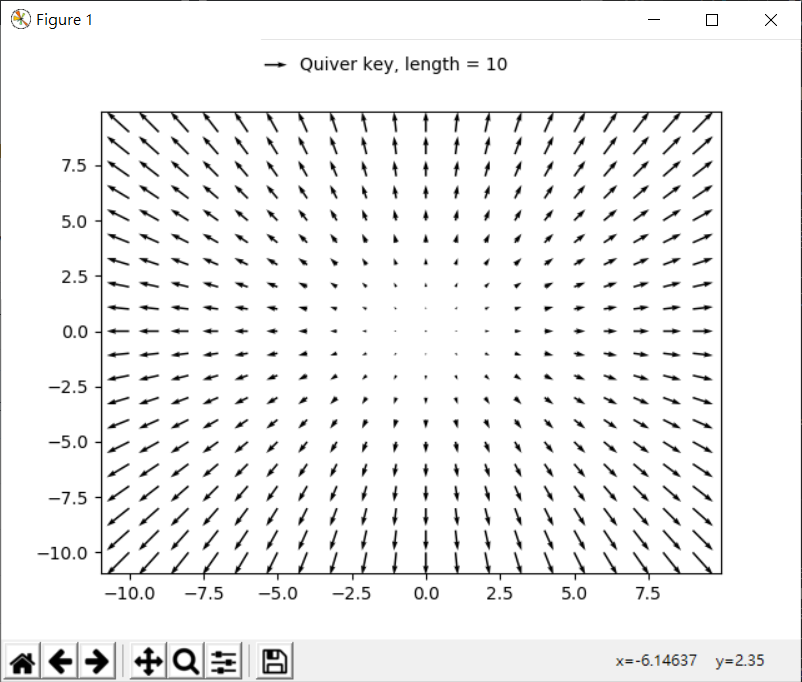
4. 機率統計

-|[normal1.py](https://github.com/ccccourse/ai/blob/master/python/08-scientific/probability/normal1.py)|[normal2.py](https://github.com/ccccourse/ai/blob/master/python/08-scientific/probability/normal2.py)|[normal3.py](https://github.com/ccccourse/ai/blob/master/python/08-scientific/probability/normal3.py)
-|-|-|-
執行結果|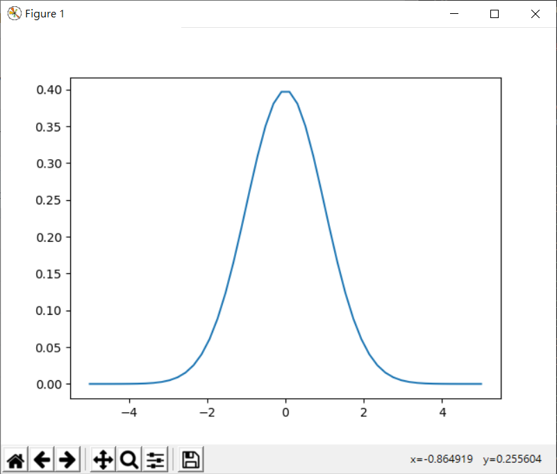|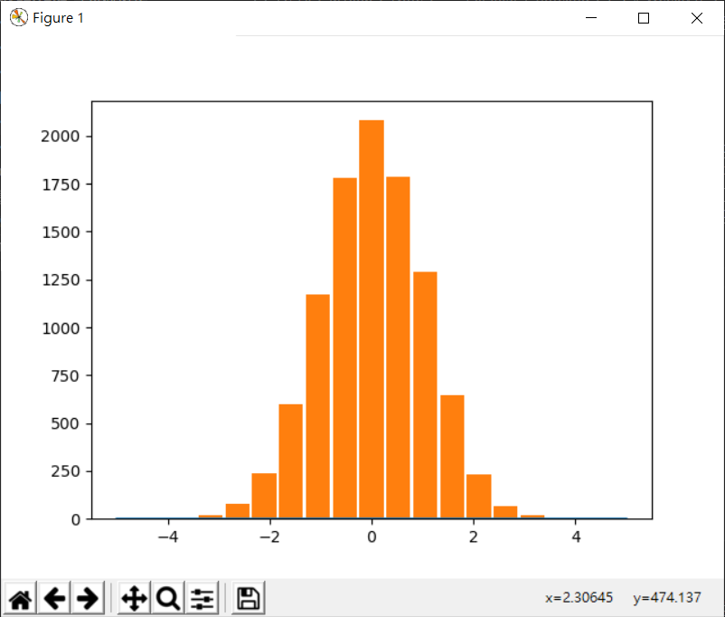|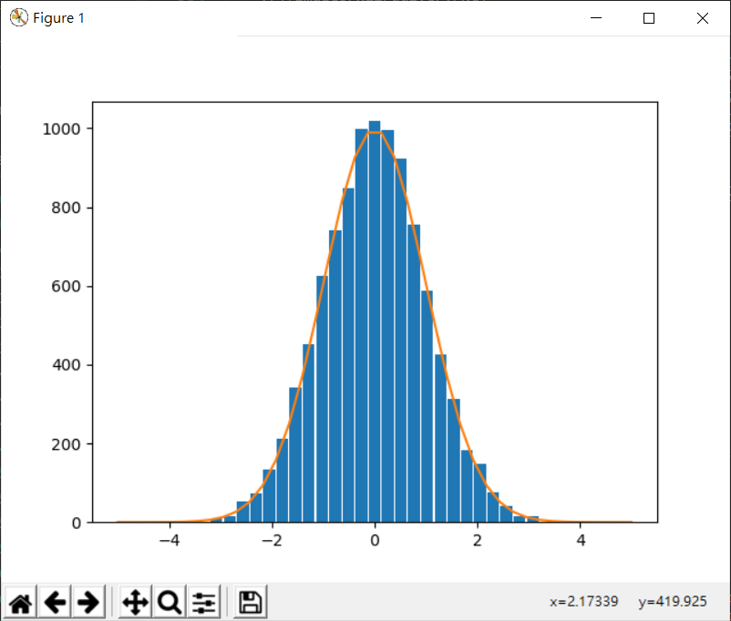
描述|常態分佈圖|統計長條圖|把noral1、2結合

-|[grid1.py](https://github.com/ccccourse/ai/blob/master/python/08-scientific/probability/grid1.py)|[clt1.py](https://github.com/ccccourse/ai/blob/master/python/08-scientific/probability/clt1.py)<br>中央極限定理
-|:-:|:-:
執行結果|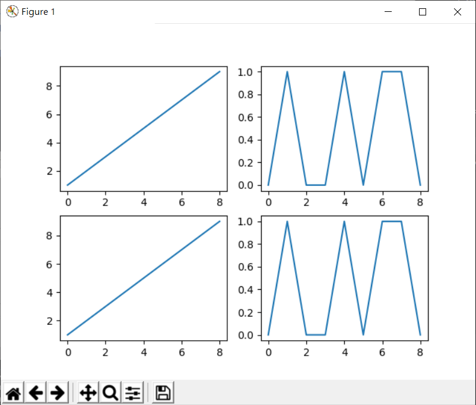|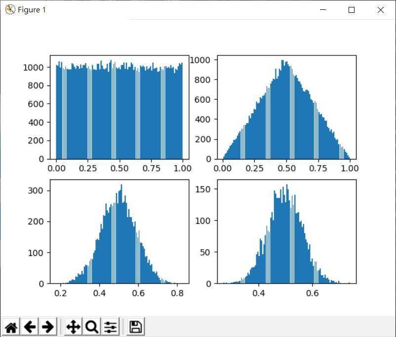左上：取一個樣本的情況，均等分佈 <br> 右上：取兩個樣本的平均值 <br> 左下：取10個樣本取平均的結果 <br> 右下：取20個樣本取平均的結果
-|-|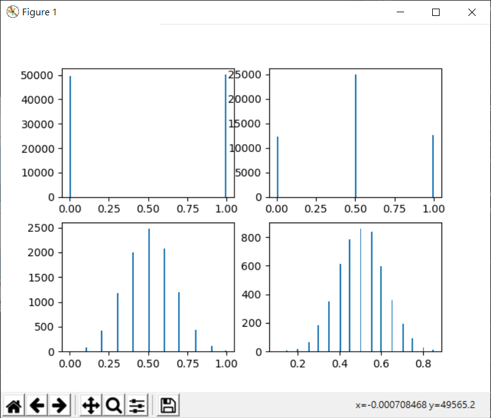擲銅板
-|-|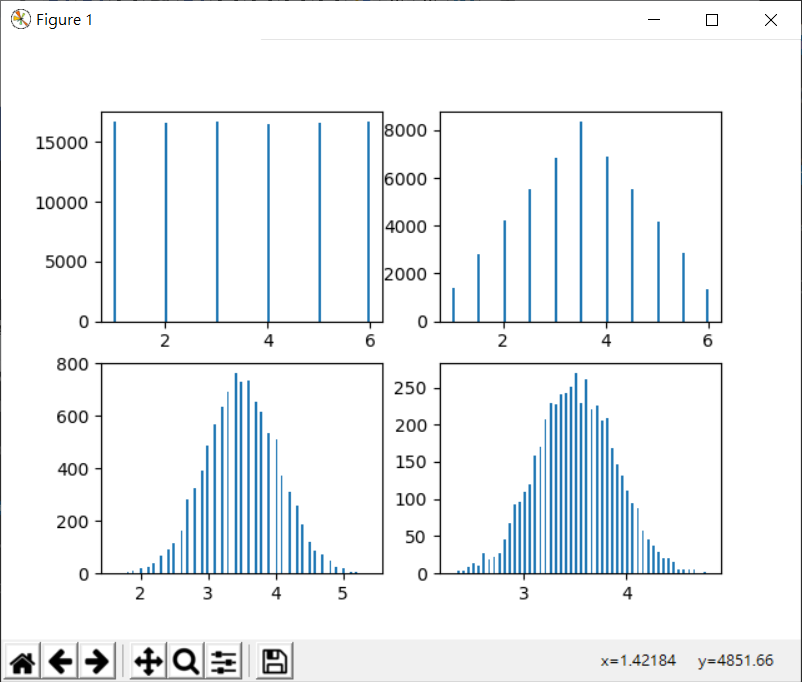

5. [clt1.py](https://github.com/ccccourse/ai/blob/master/python/08-scientific/probability/clt1.py?fbclid=IwAR3Mykdd-4WXUcNiwLDo61WlLyntjRc6Zj4Yls84VZMXxLvEeMJlfwUneEQ) 中央極限定理
## Part2
1. 統計：[學生t檢驗](https://zh.wikipedia.org/wiki/%E5%AD%B8%E7%94%9Ft%E6%AA%A2%E9%A9%97?fbclid=IwAR2agJUWlWec64x0kA5N_PF9lnhOg5fKqohXSzgBDGYiBZz3Q3JYGH3dTuM) [ttest2.py](https://github.com/ccccourse/ai/blob/master/python/08-scientific/statistics/ttest2.py)
```py
# 擷取小部分

rvs1 = stats.norm.rvs(loc=5,scale=10,size=500)  # 平均值5，標準差10，取500個樣本
rvs2 = stats.norm.rvs(loc=5,scale=10,size=500)
print(stats.ttest_ind(rvs1,rvs2))
```
2. [knn.py](https://github.com/ccccourse/ai/blob/master/python/09-patternRecognition/classify/knn.py) K-近鄰演算法：幾乎都是奇數
* 已知道正確答案，再判斷是哪一類
* 近鄰數太多，容易出錯
* 執行結果：
```c
# 5 近鄰目前最佳
PS C:\Users\USER\Desktop\LC_AI\ai2\python\09-patternRecognition\classify> python .\knn.py
預測答案： [1 0 1 0 2 0 2 0 0 0 2 0 1 1 2 2 0 2 2 1 0 2 1 2 0 0 0 0 1 0]     
正確答案： [1 0 1 0 2 0 2 0 0 0 2 0 1 1 2 2 0 2 2 1 0 2 1 1 0 0 0 0 1 0] 
PS C:\Users\USER\Desktop\LC_AI\ai2\python\09-patternRecognition\classify> python .\knn.py
預測答案： [1 0 2 1 1 0 0 0 1 1 2 2 1 1 0 1 1 1 2 1 0 0 2 1 2 0 0 0 1 0]
正確答案： [1 0 2 1 1 0 0 0 1 1 2 2 1 1 0 1 1 1 2 1 0 0 1 1 2 0 0 0 1 0] 
```
3. [kmean.py](https://github.com/ccccourse/ai/blob/master/python/09-patternRecognition/cluster/kmean.py) 分群
* 隨機產生 0 - 1 之間的數，分群
* 中心點隨機，再分群
* 執行結果：

隨機產生點|分類
:-:|:-:
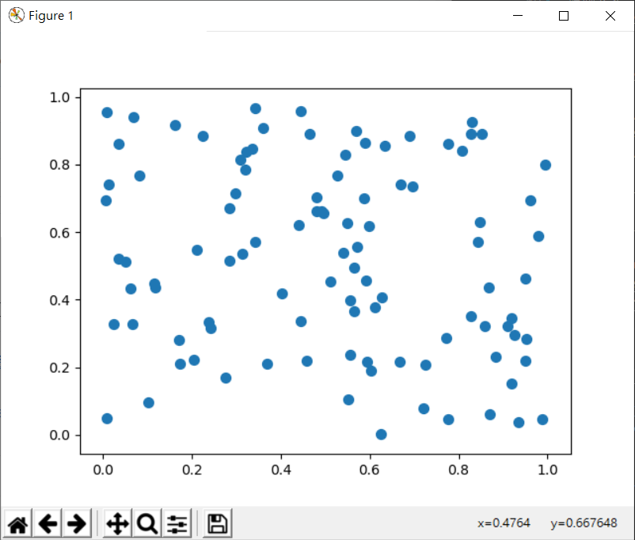|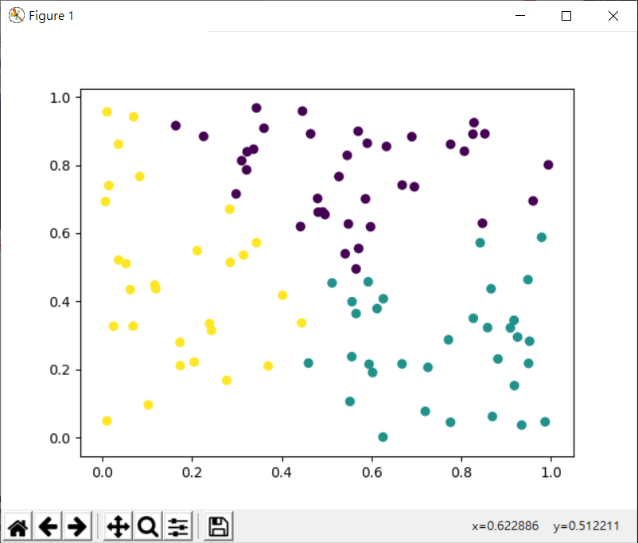

## Part3
1. 人臉辨識
* 執行結果：

---
資料來源&參考：
- [陳鍾誠老師的網站-人工智慧/09-模式識別](http://www.misavo.com/blog/%E9%99%B3%E9%8D%BE%E8%AA%A0/%E6%9B%B8%E7%B1%8D/%E7%A7%91%E5%AD%B8%E8%A8%88%E7%AE%97/E3-%E6%8E%A8%E8%AB%96%E7%B5%B1%E8%A8%88)
- [中央極限定理](https://zh.wikipedia.org/wiki/%E4%B8%AD%E5%BF%83%E6%9E%81%E9%99%90%E5%AE%9A%E7%90%86?fbclid=IwAR12VdEvAJbgRi6BA_hVSuIZ_V9ghJZpmyUJQXiiq2G8oIWYl_EvEUoKqdE)
- [學生t檢驗](https://zh.wikipedia.org/wiki/%E5%AD%B8%E7%94%9Ft%E6%AA%A2%E9%A9%97?fbclid=IwAR2agJUWlWec64x0kA5N_PF9lnhOg5fKqohXSzgBDGYiBZz3Q3JYGH3dTuM)
- [KNN 分類法則](https://ithelp.ithome.com.tw/articles/10197110?fbclid=IwAR01JwebbBH8aFK7_H6-fVI_3UCM47jG6fPp1wkYF0R3BwD2LxEzk_mLKxI)
- [機器學習: 集群分析 K-means Clustering](https://medium.com/@chih.sheng.huang821/%E6%A9%9F%E5%99%A8%E5%AD%B8%E7%BF%92-%E9%9B%86%E7%BE%A4%E5%88%86%E6%9E%90-k-means-clustering-e608a7fe1b43)
- [K means 演算法](https://dotblogs.com.tw/dragon229/2013/02/04/89919?fbclid=IwAR1jJZm21D1jIRqrGjadpREAE6eV2U5q5GoYKRnSVsqYNGFNcKmggMmLQfU)
- [Python 使用 OpenCV、Dlib 實作即時人臉偵測程式教學](https://blog.gtwang.org/programming/python-opencv-dlib-face-detection-implementation-tutorial/)