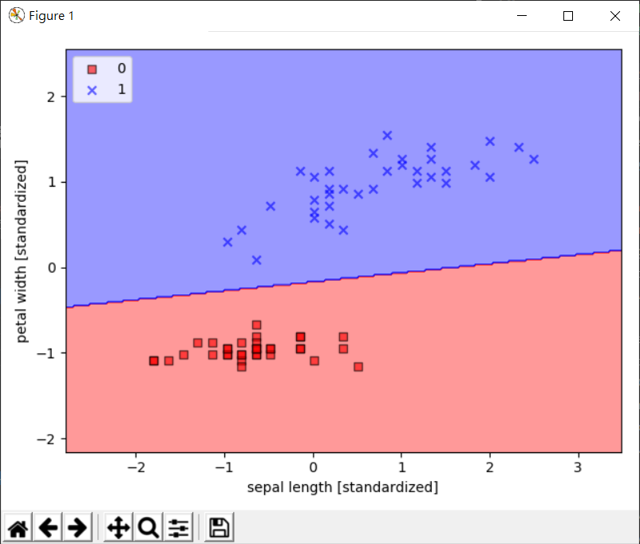

# Weekly13
> Part1：模式識別 SVM \
> Part2、Part3：機器學習
## Part1
1. [支援向量機](https://medium.com/jameslearningnote/%E8%B3%87%E6%96%99%E5%88%86%E6%9E%90-%E6%A9%9F%E5%99%A8%E5%AD%B8%E7%BF%92-%E7%AC%AC3-4%E8%AC%9B-%E6%94%AF%E6%8F%B4%E5%90%91%E9%87%8F%E6%A9%9F-support-vector-machine-%E4%BB%8B%E7%B4%B9-9c6c6925856b) [svm1.py](https://gitlab.com/ccckmit/ai2/-/blob/master/python/09-patternRecognition/svm/svm1.py)：利用 SVC 函數創建一個線性分割的物件 svm，然後開始進行分割

```py
# 擷取部分程式碼
# 關鍵程式
svm = SVC(kernel='linear', probability=True)

svm.fit(X_train_std,y_train['target'].values)
```
* 執行結果：


## Part2
1. [naiveProb.py](https://gitlab.com/ccckmit/ai2/-/blob/master/python/10-machineLearning/bayes/naiveProb.py) 單純機率
```py
# P(x,y,z) = P(x) * P(y) * P(z)
def naiveProb(prob, list):
  p = 1
  for e in list:
      p = p * prob[e]
  return p

# P(x)、P(y)、P(z) 機率
prob = {
  'x': 0.5,
  'y': 0.2,
  'z': 0.3
}

print('P(x,y,z) = P(x)P(y)P(z)=', naiveProb(prob, ['x','y','z']))
# 前提是 x,y,z 三個隨機變數都條件獨立。 （所以說是天真）
# 因為不管有沒有條件獨立都當作條件獨立
```
* 執行結果：
```c
PS C:\Users\USER\Desktop\LC_AI\ai2\python\10-machineLearning\bayes> python .\naiveProb.py
P(x,y,z) = P(x)P(y)P(z)= 0.03
```
2. [naiveBayesProb.py](https://gitlab.com/ccckmit/ai2/-/blob/master/python/10-machineLearning/bayes/naiveBayesProb.py) 天真貝式算法
```py
# P(C|F1...Fn) = P(C) * P(F1|C) * ....* P(Fn|C)
def naiveBayesProb(prob, c, f):
    p = prob[c]
    for fi in f:
        p = p * prob[c+'=>'+fi] # => 導致
    return p

prob = {
  'c1': 0.6, 'c2': 0.4,
  'c1=>f1': 0.5, 'c1=>f2': 0.8, 'c1=>f3': 0.6,
  'c2=>f1': 0.7, 'c2=>f2': 0.6, 'c2=>f3': 0.2,
}

for c in ['c1', 'c2']:
    print('P({}|f1,f2) = {}'.format(c, naiveBayesProb(prob, c, ['f1','f2'])))
```
* 執行結果：
```c
# 在 f1,f2 的情況下，是 c1 出現機率大還是 c2
PS C:\Users\USER\Desktop\LC_AI\ai2\python\10-machineLearning\bayes> python .\naiveBayesProb.py
P(c1|f1,f2) = 0.24  
P(c2|f1,f2) = 0.16799999999999998
```
3. [naiveBayesClassifier.py](https://gitlab.com/ccckmit/ai2/-/blob/master/python/10-machineLearning/bayes/naiveBayesClassifier.py) 天真貝式分類器：假設條件獨立

* 執行結果：
```c
PS C:\Users\USER\Desktop\LC_AI\ai2\python\10-machineLearning\bayes> python .\naiveBayesClassifier.py
P(c1|f1,f2) = 0.24
P(c2|f1,f2) = 0.16799999999999998
p= [0.24, 0.16799999999999998]
P(c1|f1,f2) = 0.24
P(c2|f1,f2) = 0.16799999999999998
c1 的機率最大
```
4. [馬可夫鏈](https://misavo.com/blog/%E9%99%B3%E9%8D%BE%E8%AA%A0/%E6%9B%B8%E7%B1%8D/%E4%BA%BA%E5%B7%A5%E6%99%BA%E6%85%A7/10-%E6%A9%9F%E5%99%A8%E5%AD%B8%E7%BF%92/B2-%E9%A6%AC%E5%8F%AF%E5%A4%AB%E9%8F%88?fbclid=IwAR1Ih6jSfmFwiVYFnjoIodPFOz3QT0U5pE1EGlsOo-HYxxNFEZQva1POAGE) [markov.py](https://gitlab.com/ccckmit/ai2/-/blob/master/python/10-machineLearning/markov/markov.py)：從目前狀態轉移到下一個狀態，狀態決定機率
* 有兩個狀態的馬可夫隨機系統

    * s0：狀態0；s1：狀態1
```py
# 參考： 自然語言處理 -- Hidden Markov Model http://cpmarkchang.logdown.com/posts/192352
from prob import P

def markov(s):
    p = P[s[0]]
    for i in range(1, len(s)):
        key = s[i-1]+'=>'+s[i]
        p = p * P[key]
    return p

seq = ['b', 'a', 'b', 'b']


print('P(b a b b) = P(b) P(b=>a) P(a=>b) P(b=>b) = {}*{}*{}*{} = {}'.format(P['b'], P['b=>a'], P['a=>b'], P['b=>b'], markov(seq)))
```
引入[prob.py](https://gitlab.com/ccckmit/ai2/-/blob/master/python/10-machineLearning/markov/prob.py)
```
# 狀態機率： P(a) = 0.2, P(b) = 0.8
# 轉移機率： P(x => y)
#    a   b
# a  0.7 0.3
# b  0.5 0.5

P = {
  'a': 0.2, 'b': 0.8,
  'a=>a': 0.7, 'a=>b':0.3,
  'b=>a': 0.5, 'b=>b':0.5,
}
```
* 執行結果：
```c
PS C:\Users\USER\Desktop\LC_AI\ai2\python\10-machineLearning\markov> python.exe .\markov.py
P(b a b b) = P(b) P(b=>a) P(a=>b) P(b=>b) = 0.8*0.5*0.3*0.5 = 0.06
```
5. [em.md](https://gitlab.com/ccckmit/ai2/-/blob/master/python/10-machineLearning/em/em.md) 
[em.py](https://gitlab.com/ccckmit/ai2/-/blob/master/python/10-machineLearning/em/em.py) 最大期望演算法
* 執行結果：
```c
PS C:\Users\USER\Desktop\LC_AI\ai2\python\10-machineLearning\em> python .\em.py
pA=[0.6, 0.4] pB=[0.5, 0.5] delta=9.9999
pA=[0.71301224 0.28698776] pB=[0.58133931 0.41866069] delta=0.11301223540051619
pA=[0.74529204 0.25470796] pB=[0.56925575 0.43074425] delta=0.0322798006814784
pA=[0.76809883 0.23190117] pB=[0.54953591 0.45046409] delta=0.022806798285326613
pA=[0.78316458 0.21683542] pB=[0.53461745 0.46538255] delta=0.015065749932652417
pA=[0.79105525 0.20894475] pB=[0.52628117 0.47371883] delta=0.008336287117588381
pA=[0.79453254 0.20546746] pB=[0.52239044 0.47760956] delta=0.003890729512057156
pA=[0.79592867 0.20407133] pB=[0.52072988 0.47927012] delta=0.001660559431849007
```
## Part3
1. [gibbs.py](https://gitlab.com/ccckmit/ai2/-/blob/master/python/10-machineLearning/markov/gibbs.py) [gibbs.md](https://gitlab.com/ccckmit/ai2/-/blob/master/python/10-machineLearning/markov/gibbs.md) 吉布斯採樣算法：在已知轉移矩陣的情況下求解每個狀態的平衡機率值 ，是迭代法在找不動點
* 執行結果：
```c
PS C:\Users\USER\Desktop\LC_AI\ai2\python\10-machineLearning\markov> python .\gibbs.py 
P0 = {'a': 0.2, 'b': 0.8}
P1 = {'a': 0.54, 'b': 0.46}
P1 = {'a': 0.608, 'b': 0.392}
P1 = {'a': 0.6215999999999999, 'b': 0.37839999999999996}
P1 = {'a': 0.62432, 'b': 0.37567999999999996}
P1 = {'a': 0.624864, 'b': 0.37513599999999997}
標準答案:P(a)=5/8=0.625 P(b)=3/8=0.375
```
2. [monteCarloPi.py](https://gitlab.com/ccckmit/ai2/-/blob/master/python/10-machineLearning/montecarlo/monteCarloPi.py) [蒙地卡羅方法](https://zh.wikipedia.org/wiki/%E8%92%99%E5%9C%B0%E5%8D%A1%E7%BE%85%E6%96%B9%E6%B3%95?fbclid=IwAR2fJ5_rdPjZscG9iI16lUt6Meo8jVx1UXkyf9LjhPNTbsOlVuZJ2jLvoFo)
* 每次執行的結果會不同，因為是用隨機模擬的方式算：
```c
PS C:\Users\USER\Desktop\LC_AI\ai2\python\10-machineLearning\montecarlo> python.exe .\monteCarloPi.py
MonteCarloPi(100000)= 3.13776
PS C:\Users\USER\Desktop\LC_AI\ai2\python\10-machineLearning\montecarlo> python.exe .\monteCarloPi.py
MonteCarloPi(100000)= 3.14556
PS C:\Users\USER\Desktop\LC_AI\ai2\python\10-machineLearning\montecarlo> python.exe .\monteCarloPi.py
MonteCarloPi(100000)= 3.14136
```
3. [維特比演算法](https://zh.wikipedia.org/wiki/%E7%BB%B4%E7%89%B9%E6%AF%94%E7%AE%97%E6%B3%95?fbclid=IwAR04djWGWzFSv4D_0MTE8YUMkQdU3i04vi45SCaVk9TdarkvYvfnqRCPMc4)
---
資料來源&參考：
- [陳鍾誠老師的網站-人工智慧/09-patternRecognition](https://gitlab.com/ccckmit/ai2/-/tree/master/python/09-patternRecognition)
- [資料分析&機器學習：支援向量機(Support Vector Machine)介紹](https://medium.com/jameslearningnote/%E8%B3%87%E6%96%99%E5%88%86%E6%9E%90-%E6%A9%9F%E5%99%A8%E5%AD%B8%E7%BF%92-%E7%AC%AC3-4%E8%AC%9B-%E6%94%AF%E6%8F%B4%E5%90%91%E9%87%8F%E6%A9%9F-support-vector-machine-%E4%BB%8B%E7%B4%B9-9c6c6925856b)
- [機器學習(3), 樸素貝葉斯分類器](https://mropengate.blogspot.com/2015/06/ai-ch14-3-naive-bayes-classifier.html?fbclid=IwAR18-1u-kShUqwxqiLYhYE-VJZZtDLmggtOZtxff9lGJ9Qtjdht-0LlNXp0)
- [單純貝氏分類器](https://zh.wikipedia.org/wiki/%E6%9C%B4%E7%B4%A0%E8%B4%9D%E5%8F%B6%E6%96%AF%E5%88%86%E7%B1%BB%E5%99%A8?fbclid=IwAR1jJZm21D1jIRqrGjadpREAE6eV2U5q5GoYKRnSVsqYNGFNcKmggMmLQfU)
- [陳鍾誠老師的網站-人工智慧/10-機器學習/B2-馬可夫鏈](https://misavo.com/blog/%E9%99%B3%E9%8D%BE%E8%AA%A0/%E6%9B%B8%E7%B1%8D/%E4%BA%BA%E5%B7%A5%E6%99%BA%E6%85%A7/10-%E6%A9%9F%E5%99%A8%E5%AD%B8%E7%BF%92/B2-%E9%A6%AC%E5%8F%AF%E5%A4%AB%E9%8F%88?fbclid=IwAR1Ih6jSfmFwiVYFnjoIodPFOz3QT0U5pE1EGlsOo-HYxxNFEZQva1POAGE)
- [第 84 章 馬爾可夫鏈蒙特卡羅MCMC，圖形模型，BUGS語言](https://wangcc.me/LSHTMlearningnote/MCMC-methods.html?fbclid=IwAR2-uKkmA361U2WlrJdWlBAnZ7VYnIkXHuhCSz6HhKqT4XxnRq1F1s7UJY8)
